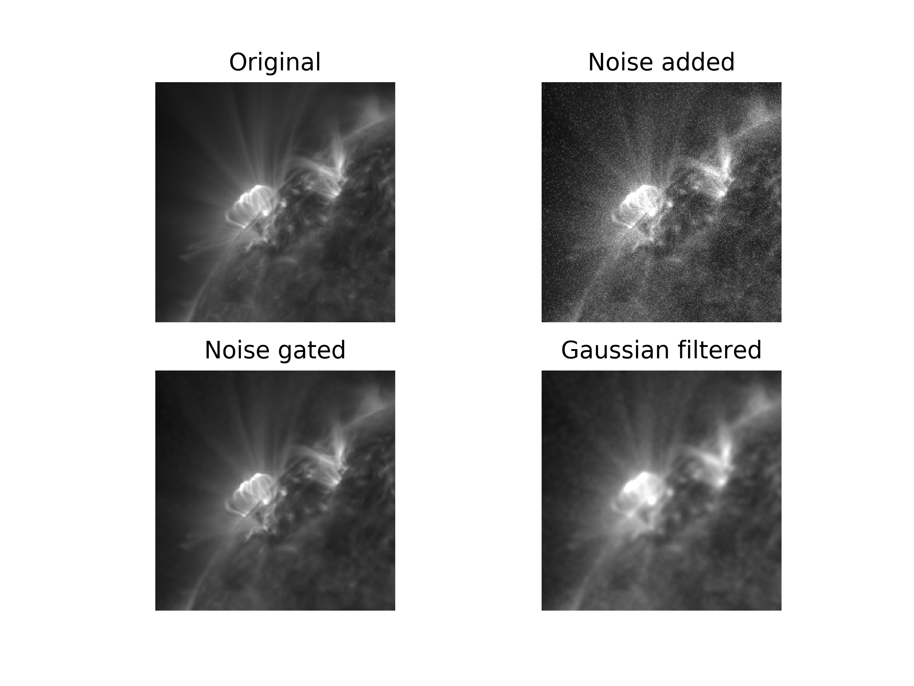
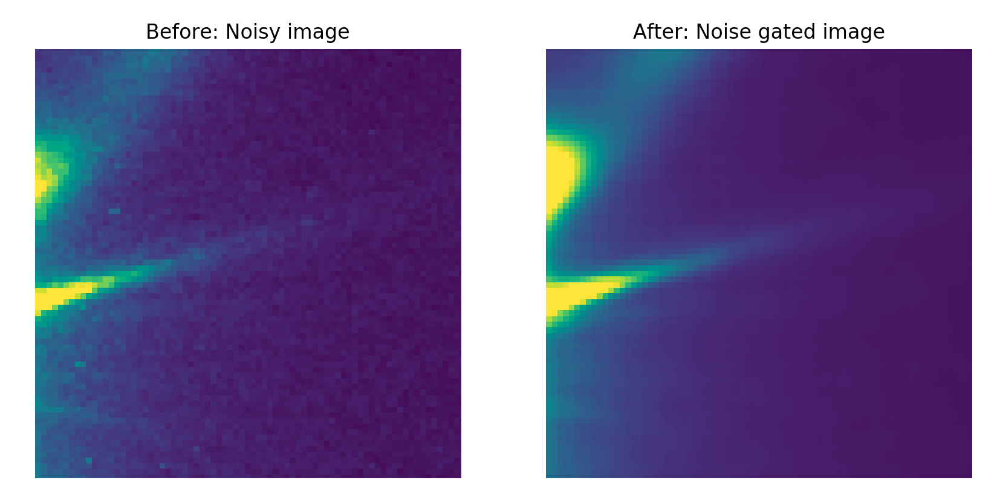

# Noise gater

> [!warning]
> This code is no longer maintained. I highly suggest using [Craig DeForest's Cython version now](https://github.com/drzowie/image-noise-gate). 

## Background
This is a python implementation of [DeForest (2017)'s approach](https://iopscience.iop.org/article/10.3847/1538-4357/aa67f1/pdf) to reducing noise in images using regional fourier 
transforms to remove noise from images. For the full details of how it works, please refer to the original paper in 
The Astrophysical Journal, Volume 838, Issue 2, article id. 155, 10 pp, 2017. 

## Setup
Since this was designed for astronomical usage, it only takes FITS as a file format.
For other uses, the code can easy be modified to read a different image format in as an array. 
If you find need for this, please contact me.

To install the dependencies, install via `requirements.txt` with:
`pip install -r requirements.txt`

## Running
The program has two required parameters:
* `__in_directory__`: directory containing FITS files to noise gate, order is determined by sorting on the filename
* `__out_directory__`: directory to save the noise gated FITS files in
  
The program has multiple optional parameters with defaults that can be viewed with `python run.py --help`:
* `__gamma__`: this indicates how much noise should be removed, for a more rigorous definition see DeForest (2017)
* `__beta_percentile__`: percentile used to determine the beta_approx, eqn 7 in DeForest (2017). 
* `__beta_count__`: how many image tiles are used when calculating beta_aprox, eqn 7 in DeForest (2017)
* `__width__`: size of the image tile cubes used noise gating

Example call:
```
python run.py IN_DIRECTORY OUT_DIRECTORY
```

## Results
You can see example.mp4 in this folder for the type of improvement expected. 
A frame from this movie is shown below:



The upper left is a good image, no cleaning necessary. However, we often see images like the upper right, 
dominated by shot noise. This image is created by taking the image on the upper left and adding poisson noise with as
ignal-to-noise ratio of 2. The algorithm still performs even if it's worse, although be more careful about artifacts 
showing up. I use DeForest's algorithm to create the cleaned image on the bottom left. This can be compared to simply 
smoothing the image to decrease the noise as in the bottom right. 


In the above image, the left is real SUVI 131 angstroms image from at flare on 2017-09-10. 
At right, is the noisegated result. 

For more examples, see the `examples` folder. 


## Todo
There are many features not yet added to this code yet:
* moving computation into C for quicker performance
* correcting the edges of images and the time series, so they aren't blacked out
* writing a 2D version
* comparing results to DeForest's PDL version for correctness

## Author
James Marcus Hughes
hughes.jmb@gmail.com
