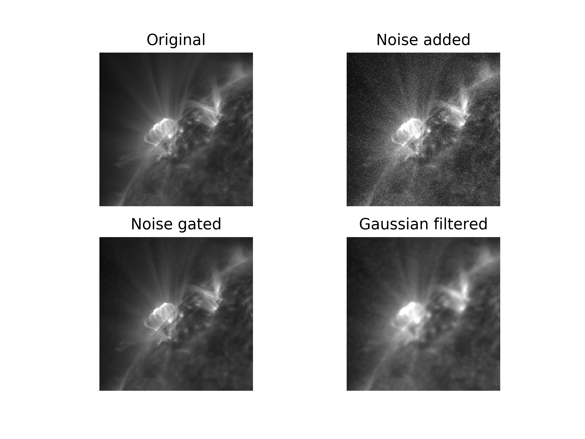

# Noise gater
**As of now only the 3D version is functioning**

## Background
This is a python implementation of DeForest (2017)'s approach to reducing noise in images using regional fourier transforms to remove noise from images. For the full details of how it works, please refer to the original paper in The Astrophysical Journal, Volume 838, Issue 2, article id. 155, 10 pp, 2017. Please note that the Southwest Research Institute, DeForest's home institution, is in the process of patenting this algorithm so any applications should be cleared by him.

The [Jupyter notebook](noise_gater_3d.ipynb) details what the code is actually doing and can be used to create a [movie](example.mp4).

## Setup
Since this was designed for astronomical usage, it only takes FITS as a file format. Therefore, you will need astropy. For other uses, the code can easy be modified to read a differnt image format in as an array. If you find need for this, please contact me.

## Running
The program has three options:
* __verbose__: outputs information regarding the current state of the program
* __gama__: this indicates how much noise should be removed, for a more rigorous definition see DeForest (2017)
* __files__: a text file that lists all the FITS image, one per line, to clean. These should be in order of time. Output images will be in the same location with a similar name, only with "_cleaned" appended.

Example call:
```
python noise_gater_3d.py --verbose --files file_path.txt --gamma 3
```

## Results
In DeForest (2017) there are example results from his Perl Data Langauge code that are similar to these. You can see example.mp4 in this folder for the type of improvement expected. A frame from this movie is shown below:



The upper left is a good image, no cleaning necessary. However, we often see images like the upper right, dominated by shot noise. This image is created by taking the image on the upper left and adding poisson noise with a signal-to-noise ratio of 2. The algorithm still performs even if it's worse, although be more careful about artifacts showing up. I use DeForest's algorithm to create the cleaned image on the bottom left. This can be compared to simply smoothing the image to decrease the noise as in the bottom right. 

## Todo
There are many features not yet added to this code yet:
* consolidate parallel version by Catalin Mitelut
* moving computation into C for quicker performance
* correcting the edges of images and the time series
* update the 2D version

## Author
James Marcus Hughes
hughes.jmb@gmail.com